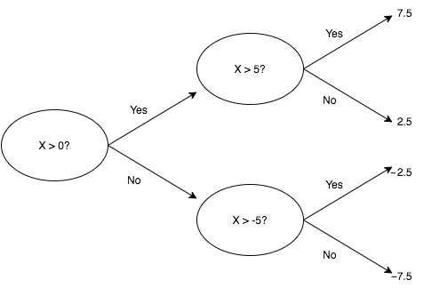
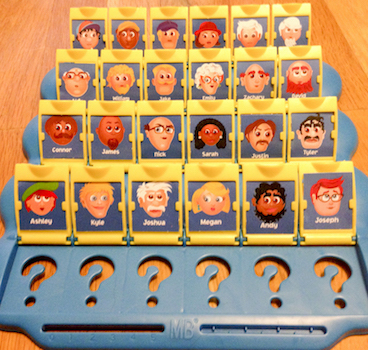
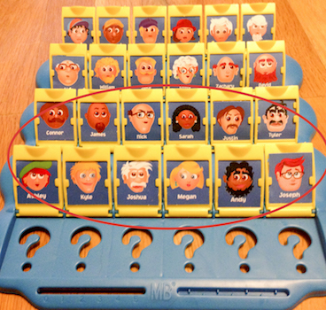
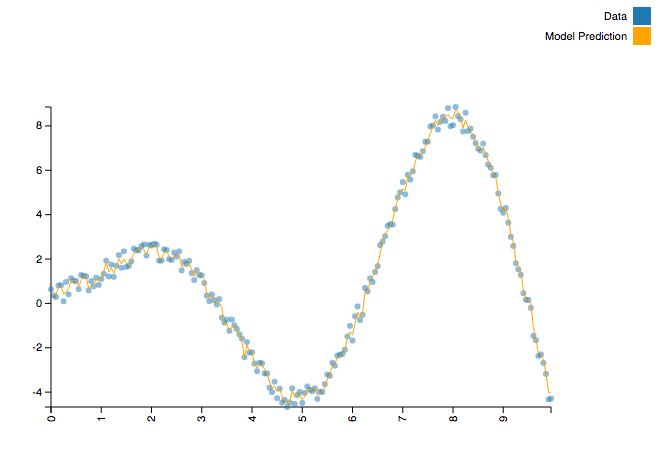
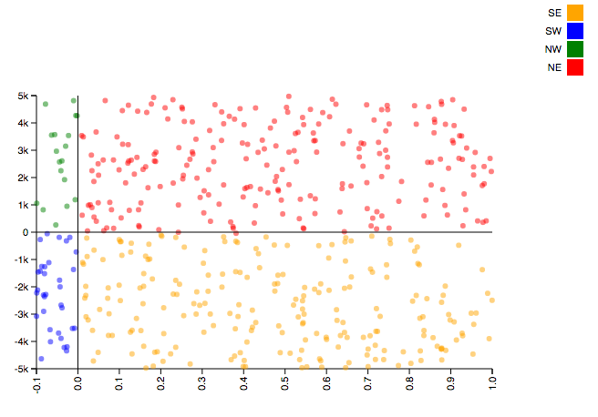
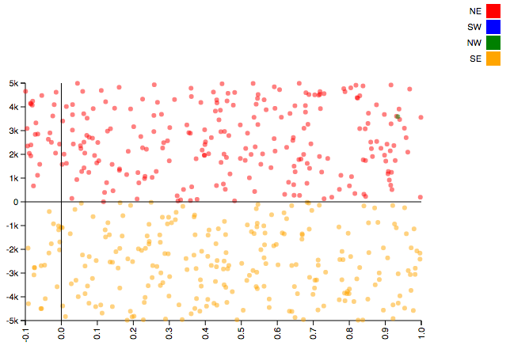

title: Random Forests in Python
author:
  name: Nathan Epstein
  twitter: epstein_n
  url: http://nepste.in
  email: _@nepste.in
--

### Random Forests in Python

- Model Internals
- Examples
- Forests vs. Neural Nets
- AI Example

--

### Model Internals

- Ensemble machine learning model.
- Composite of many simpler models called decision trees.
- The individual trees are formed by branching on each of the included features. The random forest is an aggregation of these trees.

--

### Decision Trees

- Decision trees branch on each of the included features in order to partition the data.
- For each bin in the partition (i.e. leaf of the tree), we assign an output value to inputs contained in that bin.

--

### Classification Trees

- In a classification problem, the output is categorical.
- Each branch of the tree (collection of feature values) leads to a different leaf (output value).

--

### Example: Prisoner's Dilemma


--

### Regression Trees

- The leaves of the tree still form a partition of the output space but there are many possible values within each bin.
- How do we assign a single value? We take the mean among values assigned to that bin.

--
### Example: |x| for x in (-10, 10)



--

### Tree Order

- It’s clear that the order of branches in a decision tree matters.
- Less transparent is how the path to each leaf is constructed.
- This happens according to an iterative approach called entropy minimization.

--

### Tree Order

- Unless you're familiar with information theory, the intuition behind entropy minimization may not be obvious.
- Our problem is the following: given a set of features, how do we partition the output space with a minimum depth tree?

--

### "Guess Who?"

<table><tr>
  <td>
    An intuitive way to understand this challenge is the game “Guess Who?”.
  </td>
  <td>
    
  </td>
</tr></table>


--

### Low Information Gain

- It’s typical to ask questions like whether the character “wears glasses” or “has white hair”.
- These questions represent features with low information gain.
- More likely than not, the answer will be no and we will have eliminated only a few possibilities.

--

 ### High Information Gain

 <table><tr>
  <td>
    <ul>
      <li>
        A higher information gain feature will partition the data as evenly as possible.
      </li>
    </ul>
  </td>
  <td>
    
  </td>
</tr></table>

--

### High Information Gain

- Membership in one-half of the characters is a feature which perfectly bisects the data
- We are guaranteed to eliminate exactly half of the possibilities.
- In the general case (of n characters), we can identify the target character with only log_2(n) operations.

--

### Forests from Trees

- Overfitting is a well-known pitfall for decision trees.
- For example, if we add an additional 1000 characters onto the board, asking about the 12 characters from before is a bad question and will almost certainly underperform “white hair”.

--

### Forests from Trees

- This is the purpose of random forests.
- To avoid overfitting with a single tree, we build an ensemble model through a procedure called bagging.

--

### Forests from Trees

- For some number of trees, T, and predetermined depth, D, select a random subset of the data (convention is roughly 2/3 with replacement).
- Train a decision tree on that data using a subset of the available features (roughly sqrt(M) by convention, where M is the total number of features).

--

### Parameter Tuning

- Obviously, these parameters can be tuned to fit the needs of the application.
- A model with more trees / data can take longer to train but may have greater accuracy.
- More depth / features increases the likelihood of overfitting but may be appropriate if features have complex interactions.

--

### Classification / Regression Forests

- In the case of a classification problem, we use the mode of the trees’ output to classify each value.
- For regression problems, we use the mean of the output trees.
- Note that the aggregation process is independent of the internal workings of the individual decision trees. Because each tree can make a prediction using the available features (or a subset thereof), they can be polled to form an aggregate prediction.

--

### Avoiding Overfitting

- It’s difficult to overfit with only a subset of the available information.
- By building the random forest model as an aggregation of weaker models (weak in that the trees are trained on a subset of the available information) we are able to build a strongly predictive model while avoiding the pitfalls of overfitting.

--

### Strong Suits

- What makes random forests such an effective tool is their robustness to different types of data (e.g. non-linear / non-monotonic functions, un-scaled data, data with missing values, data with poorly chosen features).
- This makes them an excellent “out of the box” tool for general machine learning problems which do not immediately suggest themselves to a specific alternative.

--

### Non-linear Functions

- Consider a function like y = x⋅sin(x) + U, where U is a random value uniformly distributed in the interval (0, 1).
- It’s a “simple” function but it is both non-monotonic and non-linear.
- A technique like simple regression is a non-starter without significant feature extraction. However, it is a simple task for a random forest.

--

```python
from sklearn.ensemble import RandomForestRegressor
import numpy as np
import math

def generate_data():
        X, Y = [], []
        f = lambda x : x * math.sin(x) + np.random.uniform()
        for x in np.arange(0, 10, 0.05):
                X.append([x])
                Y.append(f(x))
        return (X, Y)

X, Y = generate_data()
model = RandomForestRegressor()
model = model.fit(X, Y)
```

--



--

### Unscaled Features

- Consider the following example. We will seek to classify points as being within four quadrants: “NE” (x > 0 and y > 0), “NW” (x < 0 and y > 0), “SE” (x > 0 and y < 0), and “SW” (x < 0 and y < 0).
- A straightforward example, except that our x values will cover the interval (-0.1, 1) while our y values will cover the interval (-5000, 5000).

--

```python
import numpy as np
from sklearn.ensemble import RandomForestClassifier
import math

def quadrant(coords):
        EW = 'W' if coords[0] < 0 else 'E'
        NS = 'S' if coords[1] < 0 else 'N'
        return NS + EW

N = 10000
x = -0.1 + np.random.sample(N) * 1.1
y = -5000 + np.random.sample(N) * 10000

xy_coords = list(zip(x, y))
quadrant = list(map(quadrant, xy_coords))

model = RandomForestClassifier()
model = model.fit(xy_coords, quadrant)

```
--



--



--

### Neural Nets

In a time when neural networks are as popular as they are, it’s tempting to ask why any of this matters. Why not just use neural nets?

--

### Why not Neural Nets?

Parameter tuning tends to be simpler; there are well established conventions for choosing parameters in random forests but how to determine network layer structure is fairly opaque.
--

### Why not Neural Nets?

There is a more robust body of academic literature around them which makes the internal workings (arguably) easier to understand.

--

### Why not Neural Nets?

Generally simpler to implement. Popular implementations (e.g. scikit-learn) allow users to train sensible random forests with as little as a single line of code. Configuring network layer architecture generally involves more set up.

--

### Why not Neural Nets?

Random forests are inherently parallelizable and extremely well supported for distributed deployment. Through MLlib, random forests are included in Apache Spark and are therefore easily scalable.

--

# An Example AI

--

### AI Search

- Given an array of sorted numbers, we would like to find a target value as quickly as possible.

- Our random numbers will be distributed exponentially. Can we use this information to do better than binary search?

--

### Approach

- Create many example searches (random, linear, and binary).
- For each step in the searches, create an observation.
- Input will be a tuple of current index, known floor, known ceiling, current value / target value (i.e. `{ 'location': 10, 'floor': 5, 'ceil': 12, 'ratio': 1.5 }`).
- Output will be the desired step size to locate the target value.

--

### Training

```python
simulator = SearchSimulation()
training_data = simulator.observations(TRAINING_SIZE, ARRAY_SIZE)

states = pd.DataFrame(training_data['states'])
deltas = pd.DataFrame(training_data['deltas'])

model = RandomForestClassifier()
model = model.fit(states, deltas)

class AISearch(Search):
  def update_location(self):
    self.location += model.predict(self.state())[0]
```


